# Drugo poročilo
**Ime in priimek:** Robi Rihter 
<br />
**Datum:** 6.5.2023

## Vsebina poročila
 >   - Vaje 5 (15.3.2023)
 >   - Vaje 6 (22.3.2023)
 >  - Vaje 7 (29.3.2023)
 >  - Vaje 8 (5.4.2023)
 >  - Vaje 9 (12.4.2023)
 >  - Vaje 10 (19.4.2023)

## Vaje 5 (15.3.2023)
### Naloga 1
>Imamo graf usmerjen $ G=(V,E) $
>z uteženimi povezavami. Torej imamo neko funkcijo $ω:E→A$
>, ki vsaki povezavi dodeli utež iz množice $A$.
>
> Navedi nekaj možnih podatkovnih struktur za predstavitev grafa $G$. Navedi nekaj prednosti oz. slabosti vsake izmed 
njih. Ponovi tudi, kaj je v grafu pot, sprehod in cikel.

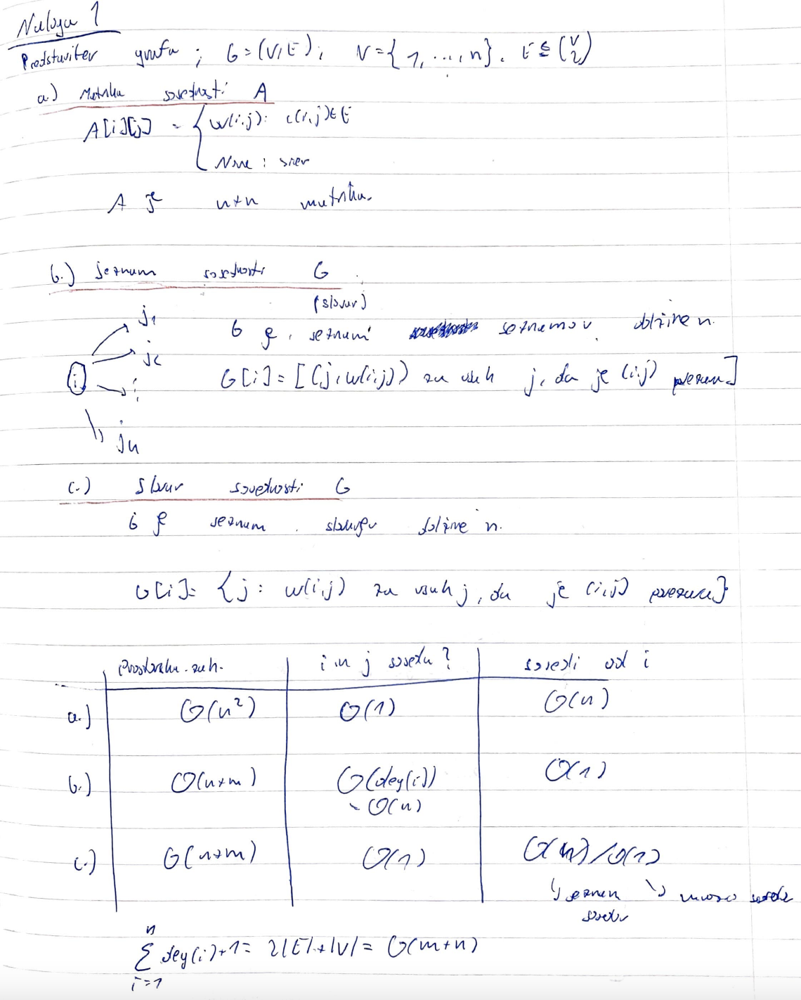

- Pot v grafu je zaporedje povezav med dvema vozliščima.
- Sprehod po grafu je zaporedje vozlišč in povezav s katerim obiščemo vsako vozlišče samo enkrat, vendar lahko pa povezave obiščemo večkrat ali pa sploh ne.
- Cikel je sprehod v grafu, ki se začne in konča v istem vozlišču in nobene povezave ne obiščemo večkrat.

### Naloga 2
>Usmerjenemu grafu $G$ z $n$ vozlišči, ki nima ciklov rečemu tudi DAG (directed acyclic graph). Vozlišča takega grafa lahko topološko uredimo. To pomeni, da obstaja da zaporedje vozlišč $(v_1,v_2,…,v_n)$, tako da ne obstaja povezava od $v_i$ do $v_j$, če je j < i.
>
>Sestavi algoritem, ki najde tako zaporedje. Namig: Katera vozlišča lahko zagotovo damo na prvo mesto v to ureditev?

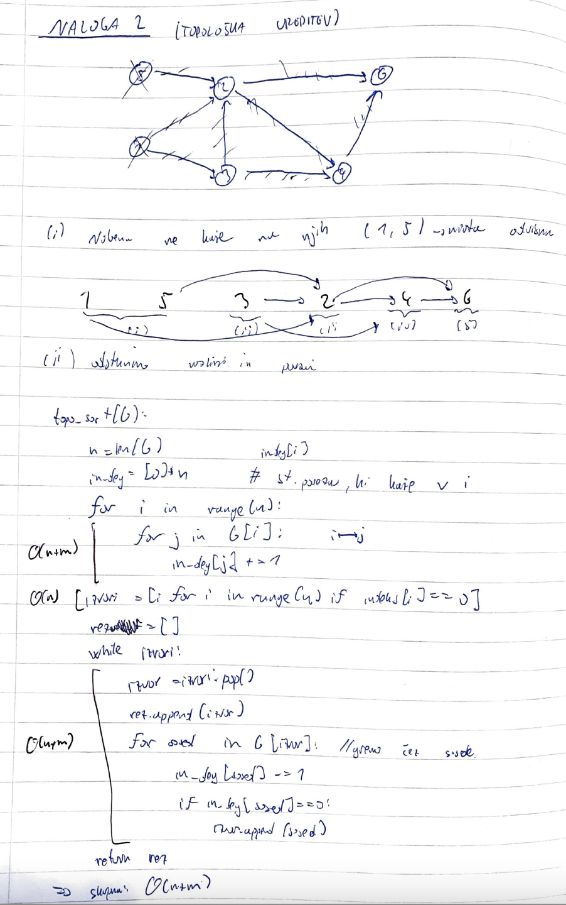

### Naloga 3
>Naj bo sedaj $G$ usmerjen utežen graf brez ciklov. Kako bi izračunal ceno najdaljše poti v tem grafu med vozliščema $s$ in $t$.


## Vaje 6 (22.3.2023)
### Naloga 1
>Ponovi BFS algoritem. Modificiraj ga, tako da bo iskal najkrajše poti v neuteženem grafu.

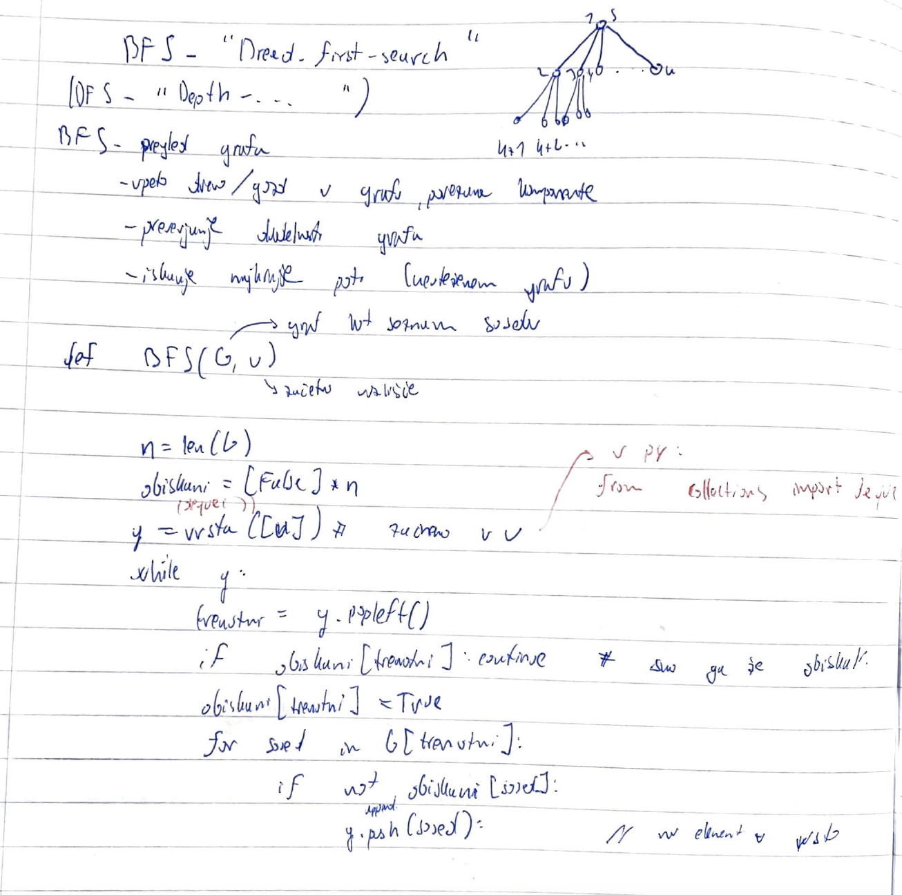
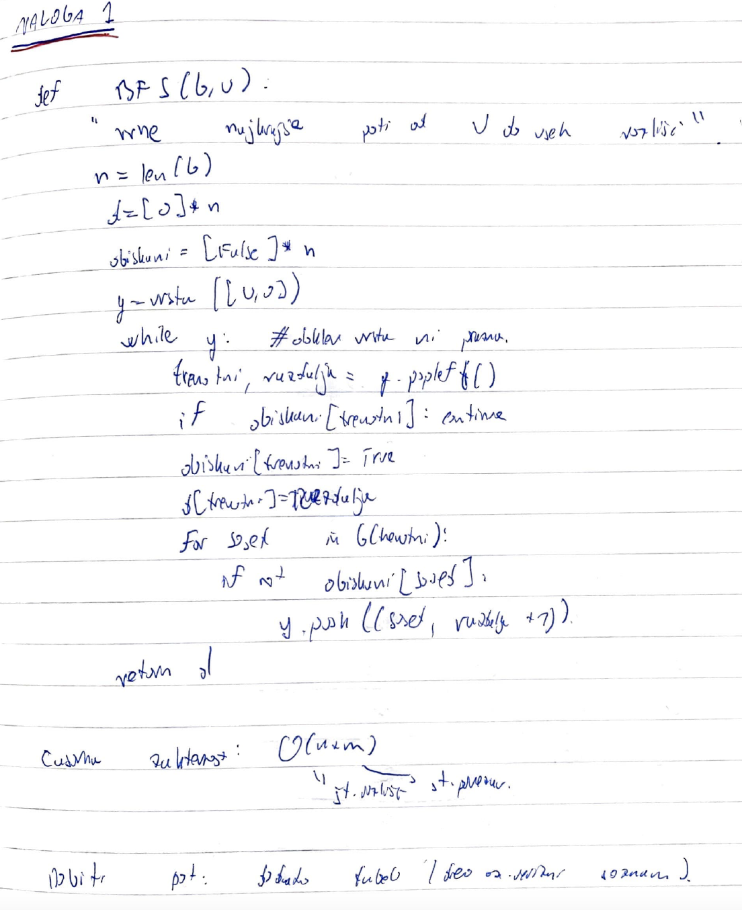
### Naloga 2
> Ponovi Floyd-Warshallow algoritem. Kaj računa in kaj vrne? Kakšna je njegova časovna zahtevnost?

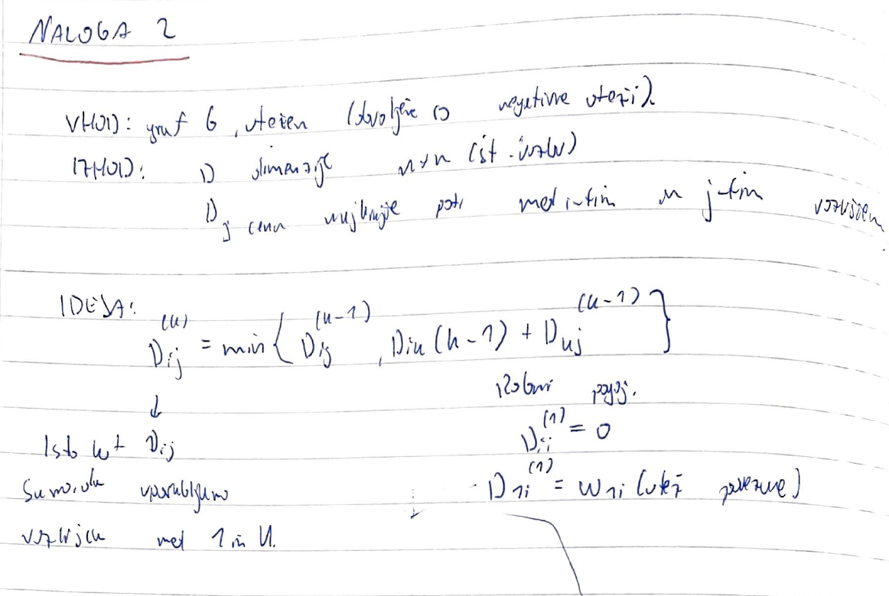
Časovna zahtevnost Floyd-Warshallow algoritma je $\mathcal{O}(n^3)$.
### Naloga 3
> Simuliraj FW algoritem na spodnjem grafu. 
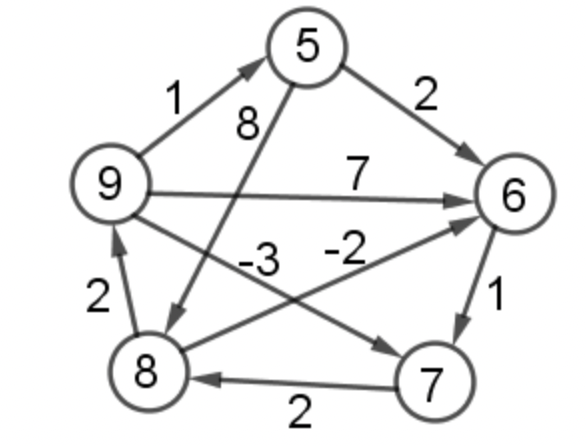

> Nato dodamo vozlišče 10 in povezavo (5 -> 10) z utežjo -1 in (10 -> 6) z utežjo 2. Kako uporabil prejšnje rezultate, da bi izračunal nove najkrajše poti?


## Vaje 7 (29.3.2023)
### Naloga 1
> Iz prejšnjih vaj obravnavaj, kako razberemo najkrajše poti s pomočjo matrike $Π$ , ki jo dobimo z FW algoritmom.

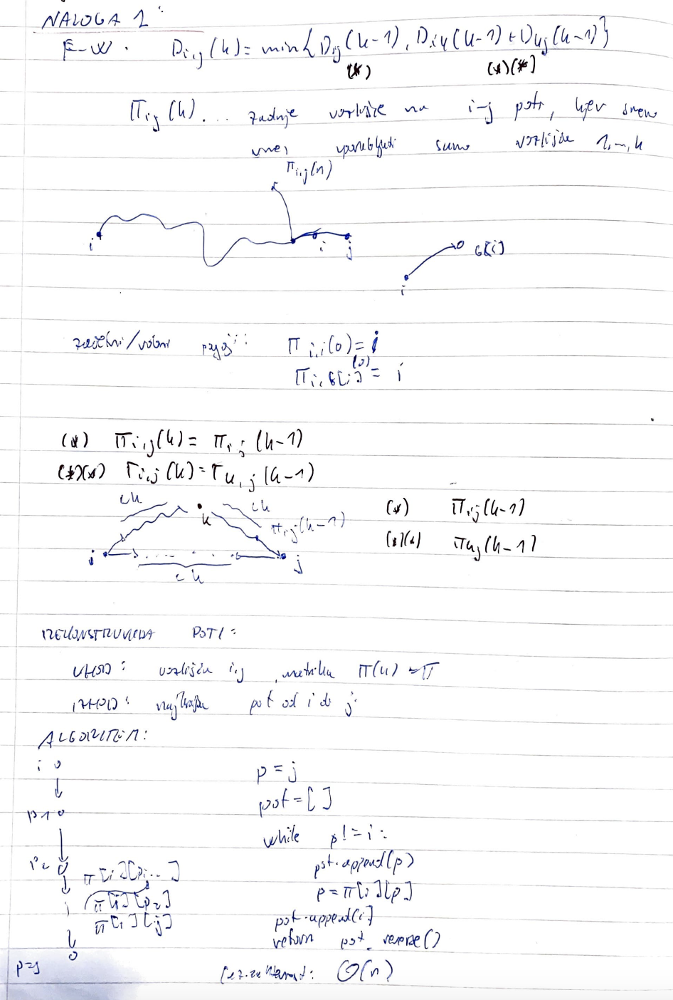
### Naloga 2
> Uteži sedaj dodamo še na vozlišča. Kako sedaj poiskati najcenejše poti?


### Naloga 3
> Premisli, zakaj preprosta sprememba v FW algoritmu iz min na max ne najde nujno najdražje poti v grafu.

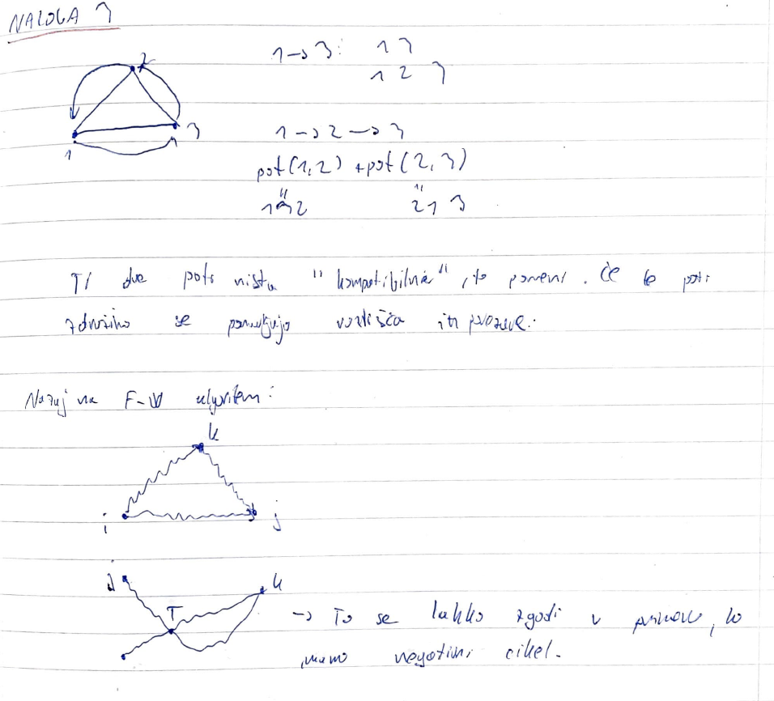

### Naloga 4
>Na neki borzi se trgujejo valute po menjalnem tečaju, ki ga podaja tabela $R$ velikosti $n×n$, kjer je $n$ število različnih valut. Vrednost $R[i][j]$ pove, da za $a$ enot valute idobimo $a⋅R[i][j]$ enot valuje $j$. Ker menjalni tečaji lahko hitro spreminjajo in so odvisni od raznih parametrov se lahko zgodi, da $R[i][j]⋅R[j][i]≠1$?

>Za primer si oglejmo naslednjo shemo: 
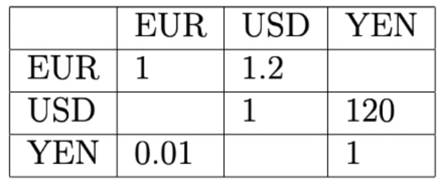

>Če trgujemo USD -> YEN -> EUR -> USD končamo z 1.44 USD. Tako zaporedje imenujemo arbitraža.
>
>Predpostavi, da ne obstaja arbitražnih zaporedij. Kako bi poiskal najbolj ugodno pretvorbo valute $i$ v valuto $j$?
>
>Kaj pa če sedaj opustimo predpostavko in dovoljujemo, da arbitražna zaporedja obstajajo. Kako bi odkril, kakšna so?

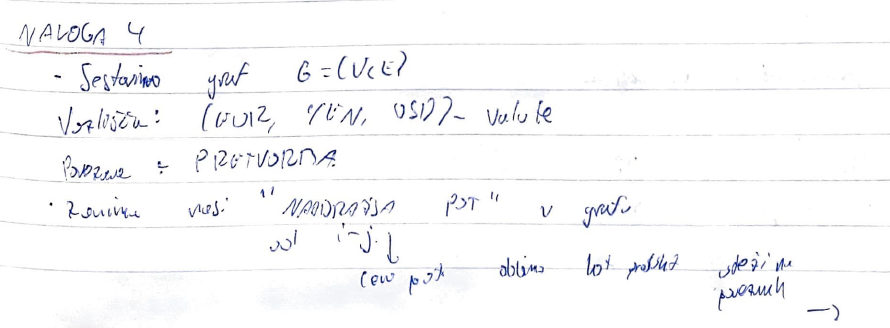
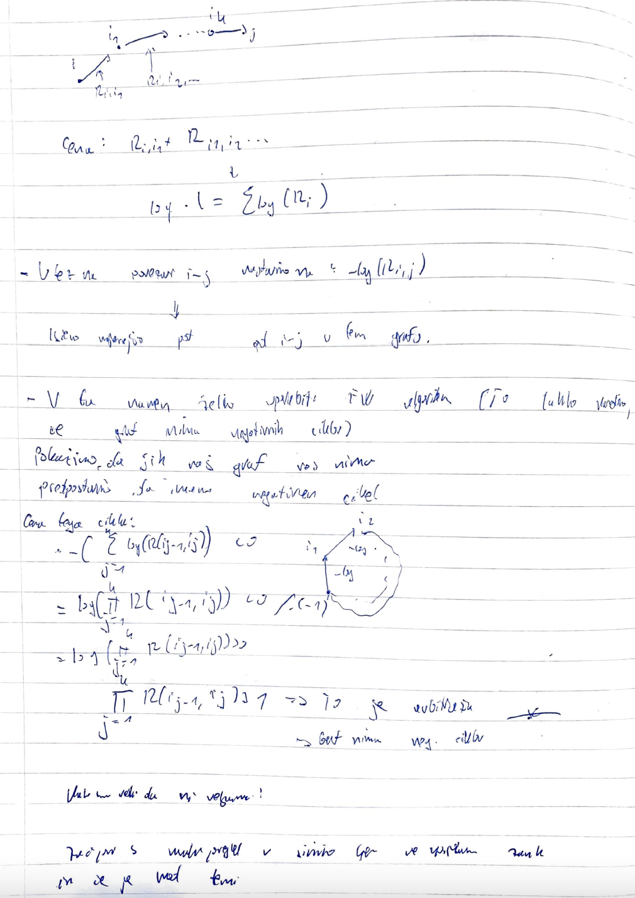


## Vaje 8 (5.4.2023)
### Naloga 1
>Vaša naloga bo, da uporabite ta algoritem na teh podatkih, torej:
>
> - roadNet-TX.txt spremenite v ustrezno podatkovno strukturo grafa.
> - poiščete najkrajše razdalje od vozlišča 100 do vseh ostalih.
> - Koliko je razdalja $dG(100,100000)$?
Katero vozlišče je najbolj oddaljeno od vozlišča 100?
> - Koliko vozlišč je dosegljivih iz vozlišča 100?

Pretvorba podatkov txt datoteke v primerno podatkovno strukturo grafa.

```python
def podatki():
    sez = []
    n = 0
    with open("roadNet-TX.txt", 'r') as dat:
        vrstice = dat.readlines()
        veljavne = vrstice[4:]
        for vrstica in veljavne:
            vrst = vrstica.strip().split('\t')
            u, v = [int(el) for el in vrst]
            n = max(n,u,v)
            sez.append((u, v))
    return n, sez

def UstvariGraf(n, seznam):
    G = [[] for _ in range(n+1)]
    
    for u,v in seznam:
        G[u].append((v, 1))
    return G
```
Implementacija Djikstra algoritma.
```python
import heapq
from collections import deque

def djikstra(G, s):
    """
    Funkcija sprejme usmerjen in utežen graf G predstavljen
    s seznamom sosednosti ter začetno vozlišče s.
    Torej G[i] = [(v_1, w_1), ... (v_d, w_d)],
    kjer je (i, v_k) povezava v grafu z utežjo w_k.
    Vrne seznam razdaljeDo, ki predstavlja najkrajšo pot od vozlišča s
    do vseh ostalih.
    Vrne tudi seznam poti, ki predstavlja drevo najkrajših poti od s
    do vseh ostalih vozlišč.
    """
    n = len(G)
    
    # Nastavimo začetne vrednosti za sezname obiskani, razdaljaDo in poti.
    obiskani = [False] * n
    razdaljeDo = [-1] * n
    poti = [None] * n

    # Na vrsto dodamo trojico (d, v, p), kjer je:
    # v vozlišče, d razdalja do njega, p pa prejšnje vozlišče na najkrajši poti od
    # s do v.
    Q = [(0, s, s)]

    while Q:
        
        # Vzamemo minimalen element iz vrste
        # heapq.heappop(Q) odstrani element iz seznama  Q, ter pri tem ohranja
        # lastnost kopice : seznam Q tretira kot dvojiško drevo!
        razdalja, u, p = heapq.heappop(Q)

        # če je že obiskan, nadaljujemo.
        if obiskani[u]:
            continue
        
        # obiščemo vozlišče ter nastavimo njegovo razdaljo
        # ter predhodnika na najkrajši poti od s do u
        obiskani[u] = True
        razdaljeDo[u] = razdalja
        poti[u] = p

        # gremo čez vse sosede in dodamo potrebne elemente na vrsto.
        for (v, teza) in G[u]:
            if not obiskani[v]:

                # heap.heappush(Q, elem) doda element v seznam Q, kjer ohranja lastnost kopice.
                heapq.heappush(Q, (razdalja + teza, v, u))

    return razdaljeDo, poti
```

Najkrajše razdalje od vozlišča 100 do vseh ostalih
```python
razdalje, poti = djikstra(G, 100)
```

Koliko je razdalja $dG(100,100000)$?
```python
print(razdalje[100000])
# Razdalja znaša 240.
```
Katero vozlišče je najbolj oddaljeno od vozlišča 100?
```python
naj = max(razdalje)
indeks = razdalje.index(naj)
print(G[indeks][0][0])
# [(1389038, 1)]
# Od vozlišča 100 je najbolj oddaljeno vozlišče 1389038
```

Koliko vozlišč je dosegljivih iz volišča 100?
```python
print(len(razdalje))
#Iz vozlišča 100 je dosegljivih 1393383 vozlišč. 
```
### Naloga 2
> Glede na to, da graf ni utežen, lahko za isto nalogo implementiramo BFS algoritem. Implementiraj BFS algoritem, ki bo poiskal dolžine najkrajših poti od s do vseh ostalih vozlišč. Vrne naj tudi drevo najkrajših poti, tako kot Djikstra. Preveri iste zadeve kot zgoraj, dobiti moraš seveda iste odgovore.

```python
def bfs_iskanje(G, u):
    '''Implemantacija BFS algoritma.
    Funkcija sprejme usmerjen in utežen graf G predstavljen
    s seznamom sosednosti ter začetno vozlišče s.
    Torej G[i] = [(v_1, w_1), ... (v_d, w_d)],
    kjer je (i, v_k) povezava v grafu z utežjo w_k.'''
    n = len(G)
    d = [-1]*n
    obiskani = [False]*n
    q = [(u,0,u)]
    poti = [None]*n
    while q:
        trenutni, razdalja, prej = q.pop(0)
        if obiskani[trenutni]:
            continue
        obiskani[trenutni] = True
        d[trenutni] = razdalja
        poti[trenutni] = prej
        for sosed, cena in G[trenutni]:
            if not obiskani[sosed]:
                q.append((sosed, razdalja+1, trenutni))
    return d, poti

# Glavni program
n = podatki()[0]
sez = podatki()[1]
G = UstvariGraf(n, sez)
razdalje, poti = bfs_iskanje(G, 100) 
```
Dobimo iste odgovre kot pri nalogi 1.
### Naloga 3
> Oba algoritma dodelaj, tako da dodaš nov vhodni podatek $t$, ki predstavlja končno vozlišče. Algoritma naj torej vrneta razdaljo med $s$ in $t$ v grafu ter pote (kot drevo) med njima. Delujeta naj, tako da se ustavita takoj ko najdemo željeno pot.
```python
from podatki import podatki, UstvariGraf

def bfs_iskanjeOduDot(G, u, t):
    '''Implemantacija BFS algoritma od vozlišča u do vozlišča t
       Funkcija vrne razdaljo in seznam ocetov'''
    if u == t: #Vozlisci se ujemata
        return 0, []
    n = len(G)
    d = [-1]*n
    obiskani = [False]*n
    q = [(u,0,u)] #Vozlišča in njihovi starši
    vrsta = [(u,0,u)]
    poti = []
    while q:
        trenutni, razdalja, prej = q.pop(0)
        if obiskani[trenutni]:
            continue
            
        obiskani[trenutni] = True
        for sosed in G[trenutni]:
            if razdalja == 0 and sosed == t: #Direktni sosed
                return 1, [sosed, u]
            if not obiskani[sosed]:
                q += [(sosed, razdalja + 1, trenutni)]
                vrsta += [(sosed, razdalja, trenutni)]
            if sosed == t:
                poti.append(t)
                poti.append(trenutni)
                while True: #Ustavimo se ko pridemo do vozlisca t.
                    for element in vrsta:
                        if element[0] == trenutni:
                            prej = element[2]
                            if prej == u:
                                poti.append(u)
                                return razdalja + 1, poti
                            poti.append(prej)
                            trenutni = prej
```

Dodelan Djikstra

```python
import heapq
from collections import deque

def djikstra_s_t(G, s, t):
    """
    Funkcija sprejme usmerjen in utežen graf G predstavljen
    s seznamom sosednosti ter začetno vozlišče s.
    Torej G[i] = [(v_1, w_1), ... (v_d, w_d)],
    kjer je (i, v_k) povezava v grafu z utežjo w_k.
    Vrne seznam razdaljeDo, ki predstavlja najkrajšo pot od vozlišča s
    do vseh ostalih.
    Vrne tudi seznam poti, ki predstavlja drevo najkrajših poti od s
    do vseh ostalih vozlišč.
    Vozlišče t je končno vozlišče.
    Dobljeno od Jernej Rencelj.
    """
    n = len(G)
    
    # Nastavimo začetne vrednosti za sezname obiskani, razdaljaDo in poti.
    obiskani = [False] * n
    razdaljeDo = [-1] * n
    poti = [None] * n

    # Na vrsto dodamo trojico (d, v, p), kjer je:
    # v vozlišče, d razdalja do njega, p pa prejšnje vozlišče na najkrajši poti od
    # s do v.
    Q = [(0, s, s)]

    while Q:
        
        # Vzamemo minimalen element iz vrste
        # heapq.heappop(Q) odstrani element iz seznama  Q, ter pri tem ohranja
        # lastnost kopice : seznam Q tretira kot dvojiško drevo!
        razdalja, u, p = heapq.heappop(Q)

        # če je že obiskan, nadaljujemo.
        if obiskani[u]:
            continue
        
        # obiščemo vozlišče ter nastavimo njegovo razdaljo
        # ter predhodnika na najkrajši poti od s do u
        obiskani[u] = True
        razdaljeDo[u] = razdalja
        poti[u] = p

        if u == t:
            pot_do_t = []
            pred = poti[t]
            while pred != s:
                pot_do_t.append(pred)
                pred = poti[pred]
            pot_do_t.append(s)
            return razdaljeDo[t], pot_do_t
        # gremo čez vse sosede in dodamo potrebne elemente na vrsto.
        for (v, teza) in G[u]:
            if not obiskani[v]:

                # heap.heappush(Q, elem) doda element v seznam Q, kjer ohranja lastnost kopice.
                heapq.heappush(Q, (razdalja + teza, v, u))

    return razdaljeDo, poti

##### Primer uporabe

G = [
    [(1,1.5), (5,2)],
    [(3, 1), (4, 1.2), (5, 0.3)],
    [(4,1), (5, 0.8)],
    [(5,1), (2, 1.5)],
    [(4,1), (5, 0.8)],
    [(0, 1), (1,0.5), (4, 2)]
]

if __name__ == "__main__":
    razdalje, poti = djikstra_s_t(G, 1, 5)
    print(razdalje, poti)
```
Izhod:
```python
0.3 [1] #Razdalja: 0.3, Poti: [1]
```
### Naloga 4
> Zapiši funkcijo, ki sprejme začetno vozlišče $s$, končno vozlišče $t$ ter drevo najkrajših poti ter vrne najkrajšo pot med njima v obliki seznama.
>
>Sedaj rekonstruiraj najkrajšo pot med vozliščem 100 in 100000.

```python
from podatki import podatki, UstvariGraf
from djikstra import djikstra

def najkrajsa_poti(s, t, drevo):
    '''Funkcija sprejme začetno vozlišče s ,končno vozlišče t
        ter drevo najkrajših poti ter vrne najkrajšo pot med njima v obliki seznama.'''
    seznam = [t]
    v = drevo[t]
    while v != s:
        seznam.append(v)
        v = drevo[v]
    seznam.append(s)
    return seznam

n = podatki()[0]
sez = podatki()[1]
G = UstvariGraf(n, sez)
razdalje, poti = djikstra(G, 100)

pot = najkrajsa_poti(100, 100000, poti)
print(pot)
```
Izhodni seznam:
```python
[100000, 99998, 99999, 100467, 100033, 100032, 100040, 100058, 100243, 100241, 100500, 100508, 98001, 97982, 98000, 98011, 98012, 779778, 779791, 779776, 779486, 779777, 783903, 783916, 783913, 783911, 774263, 774226, 774224, 774223, 784659, 784660, 774167, 774214, 774213, 774237, 774219, 774220, 774238, 774433, 774432, 774396, 774467, 774471, 775166, 774434, 774399, 774436, 775216, 775191, 775217, 775230, 954061, 954060, 954064, 954192, 952546, 954457, 954460, 954459, 954433, 952479, 952508, 952427, 952510, 952501, 952497, 952498, 952495, 952494, 952282, 952489, 952487, 952488, 952889, 951404, 951403, 951309, 951384, 951380, 951381, 951378, 951382, 684930, 684928, 684929, 684926, 684925, 684935, 684675, 684674, 684527, 684514, 684492, 684498, 684500, 684567, 684778, 684782, 684833, 684832, 684831, 684888, 950672, 950673, 957830, 950662, 950684, 658334, 658303, 658301, 658304, 658305, 658217, 658293, 658292, 658194, 658178, 657260, 657261, 657307, 657355, 657290, 657284, 657206, 657205, 657198, 657199, 657203, 657204, 657328, 657333, 657219, 657319, 657322, 657323, 657294, 657313, 657968, 657361, 657709, 657710, 657634, 657629, 657834, 657970, 657971, 657972, 657451, 657456, 657973, 657975, 657974, 657440, 657862, 657863, 656911, 657887, 657888, 657446, 657831, 654470, 654469, 654477, 654288, 654287, 654542, 654610, 662085, 662077, 662075, 661994, 662058, 662082, 662050, 662083, 662536, 662463, 662461, 662209, 662203, 662458, 662457, 662459, 662455, 662453, 662456, 662132, 662545, 9794, 9792, 7338, 7333, 7324, 7322, 7323, 7312, 7313, 7314, 10804, 7309, 7301, 7302, 7351, 7349, 7346, 3933, 3562, 3563, 3611, 3615, 3617, 3613, 3549, 3543, 3550, 3551, 3496, 3497, 3664, 3593, 3587, 3582, 1859, 1854, 1851, 1749, 1720, 164, 180, 183, 1866, 1680, 1664, 1653, 1636, 1635, 104, 103, 101, 100]
```

### Naloga 5
> Analiziraj časovne zahtevnosti algoritmov. Primerjaj hitrost med djikstro in BFS-jem. Prav tako analiziraj razliko med djikstro, ki izračuna najkrajše poti od s do vseh ostalih ter jo primerjaj z tisto verzijo iz Naloge 3.
>
> Če nas bi zanimale najkrajše poti od s do t_1, t_2, ..., t_k, kateri algoritem bi uporabil? Probaj odgovor podat na podlagi parametra k, ter analize, ki si jo opravil.

V teoriji sta časovni zahtevnosti algoritmov naslednji:
- Djikstra: $\mathcal{O}(2 \cdot V)$, kjer je $V$ stevilo vozlišč grafa
- BFS-algoritem: $\mathcal{O}(V + E)$, kjer sta $V$ in $E$ število vozliščin povezav grafa.
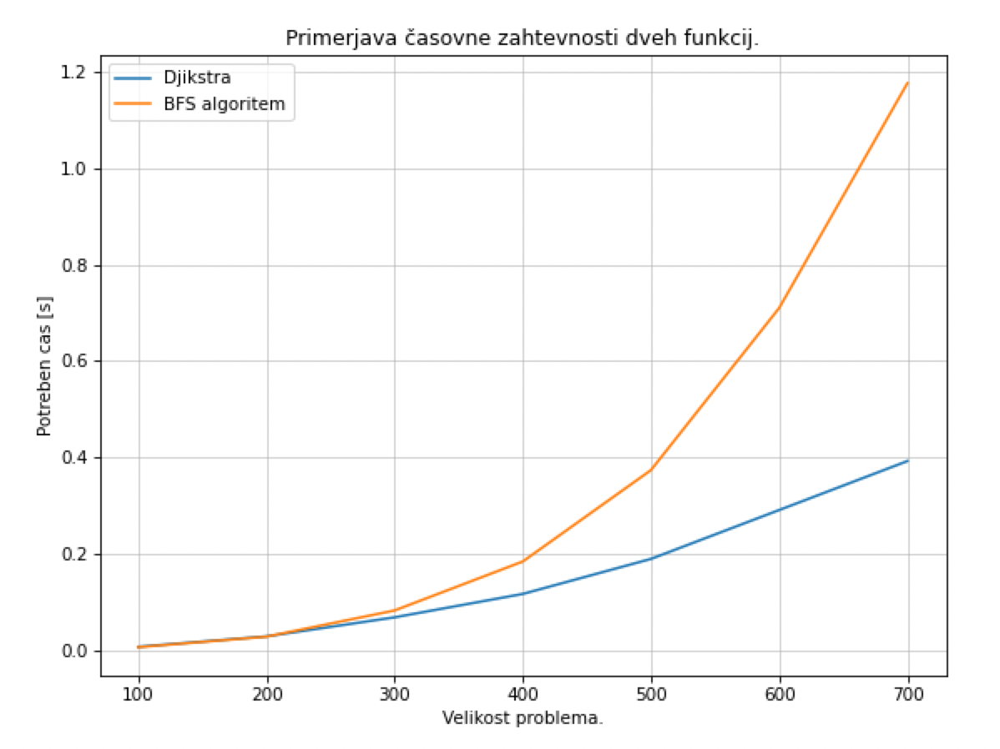

fun1 je Dijkstra in fun2 je BFS-algoritem.

V mojem primeru za velike grafe dela BFS-algoritem pocasneje kot Dijkstra, ampak nevem tocno zakaj saj bi teoreticno moral delat hitreje.

### PRIMERJAVA DJIKSTRA ALGORITMOV.
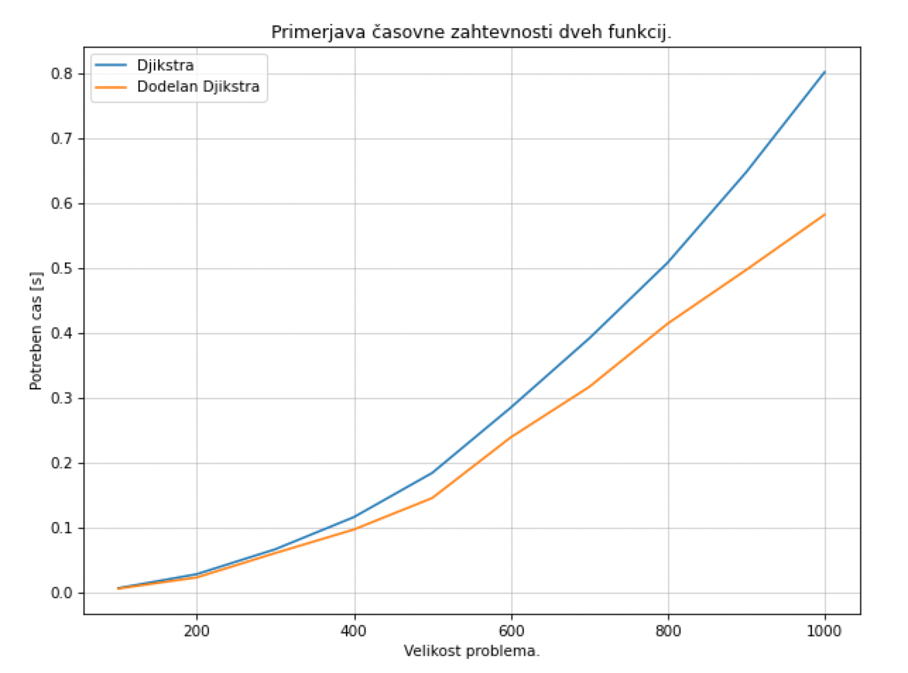

Izkaže se, da dodelan djikstra dela hitreje saj se ustavi takoj, ko najde željeno pot, kjer pa Djisktra izračuna pot do vseh ostalih

Če nas zanima najkrajša pot do vseh ostalih ali do ene, se nam izplača izbrati Djikstra algoritem.
Če imamo vse povezave pozitivne in nas zanima najkrajša  pot od ene točke do vseh ostalih je najboljše da izberemo Djikstra algoritem, drugače rajše izberemo BFS.

Če imamo vse povezave pozitivne in nas zanima najkrajša  pot od ene točke do vseh ostalih je najboljše da izberemo Djikstra algoritem, drugače rajše izberemo BFS.

## Dodatna primerjava Djikstra in Bellman-Ford algoritma

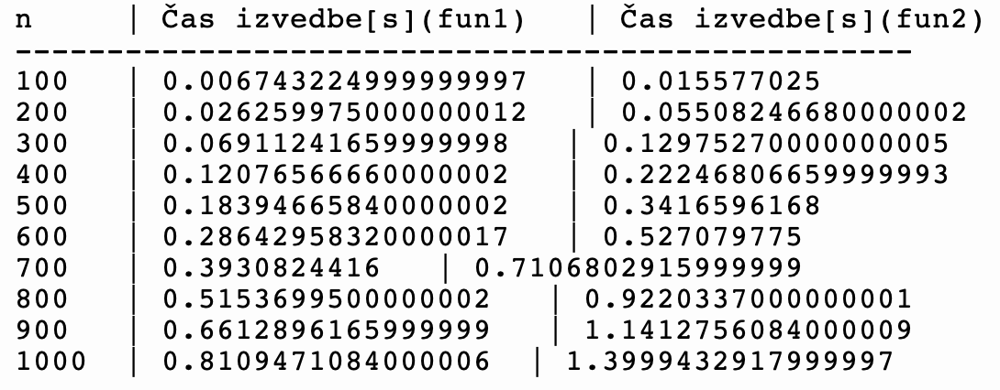

Opazimo, da je Bellman-Ford časovno malo bolj zahteven kot Djikstra.
Teoretična časovna zahtevnost: $\mathcal{O}(V \cdot E)$, kjer je $V$ število vozlišč in $E$ število povezav v grafu.
## Vaje 9 (12.4.2023)
### Naloga 1
>Konstruirajte nov graf, ki vsebuje le vozlišča od $0$ do $N$. 
Vsaki povezavi določite neko pozitivno utež (lahko čisto naključno) in zadevo shranite v novo .txt datoteko. Vrstice naj bodo oblike $u$ $v$ $w(u,v)$, kjer je $(u,v)$ povezava in $w(u,v)$ njena utež.


```python
import random

def gen_graf(N):
    '''Funkcija konstruira nov graf, ki vsebuje le vozlišča od 0 do N.'''
    graf = []
    for vozl in range(N + 1):
        tab = []  # tabela sosedov i-tega vozlisca
        for sosed in range(random.randint(1,N+1)):  #Vsako vozlisce bo imelo vsaj enega soseda.
            tab.append((random.randint(0,N+1), random.randint(0,N+1)))
        graf.append(tab)
    return graf

def txt(graf):
    '''Podatke o grafu shranimo v txt datoteko.'''
    with open('podatki_graf.txt', 'w') as dat:
        for i, sosedje in enumerate(graf):
            for sosed in sosedje:
                dat.write('{} {} {}\n'.format(i, sosed[0], sosed[1]))

txt(gen_graf(40)) #Poklicemo funkcijo
```
### Naloga 2
>Implementiranje še Bellman-Fordov algoritem in ga poženite na grafu iz prejšnje naloge. Analiziraje kako velik N iz prejšne naloge morate vzeti, da bo algoritem še deloval v zglednem času.

Implementacija Bellman-Ford algoritma
```python
def BellmanFord(graf, zac, n):
    '''Implementacija Bellman fordovega algoritma'''
    razdalje = [float("Inf")] * n #n predstavlja stevilo vozlov v grafu
    razdalje[zac] = 0

    for _ in range(n - 1):
        spremenba = False
        for u, v, w in graf:
            if razdalje[u] != float("Inf") and razdalje[u] + w < razdalje[v]: #Ali obstaja bliznjica?
                spremeba = True
                razdalje[v] = razdalje[u] + w
        if not spremenba:
            break

    for u, v, w in graf: #Preverimo negativne cikle.
        if razdalje[u] != float("Inf") and razdalje[u] + w < razdalje[v]:
            print("Graf vsebuje negativen cikel.")
            return None
        
    return razdalje
```
Test algoritma
```python
def podatki():
    sez = []
    with open("podatki_graf.txt", 'r') as dat:
        for vrstica in dat:
            zac, konc, utez = vrstica.strip().split(' ')
            sez.append((int(zac), int(konc), int(utez)))
    return sez

razdalje = BellmanFord(podatki(), 0, len(podatki()))
```
Izhodni seznam:
```python
[0, 4, 6, 6, 8, 13, 4, 6, 5, 7, 5, 4, 17, 11, 3, 18, 13, 2, 4, 5,...
```
## Vaje 10 (19.4.2023)
### Naloga 1
>Simuliraj delovanje (min) kopice. Za vsavljanje je kot operacija število, za brisanje pa x. Za boljšo predstavo nariši kar drevesa.
>
>Operacije: 8,2,1,3,7,6, x, x, 5, x, -3, x

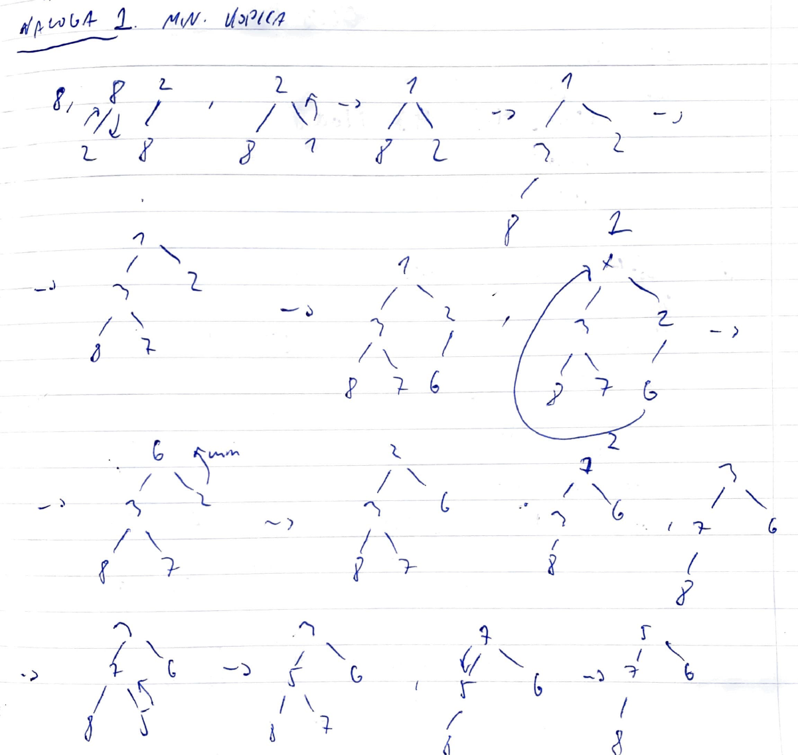

### Naloga 2
> Predstavi kopico s seznamom in zapiši delovanje pop() in push(x) operacij.

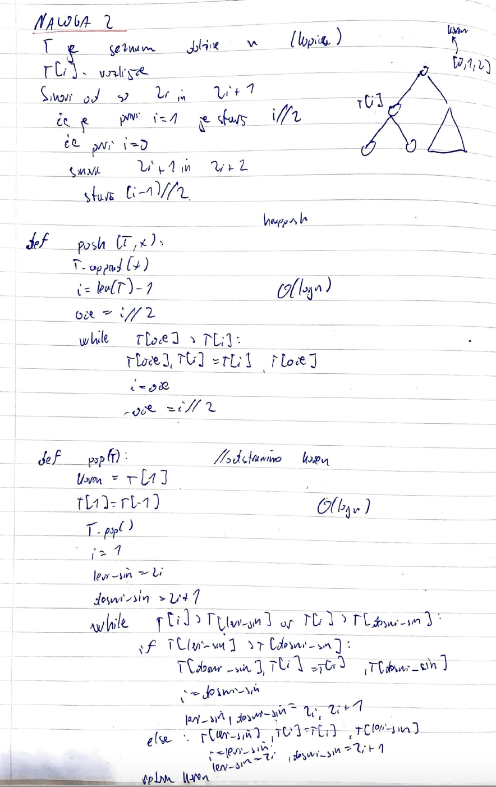

### Naloga 3
> Kako bi s kopico sortiral seznam? Časovna zahtevnost? Kako in podanega seznama nardiš kopico v O(n) časa.

